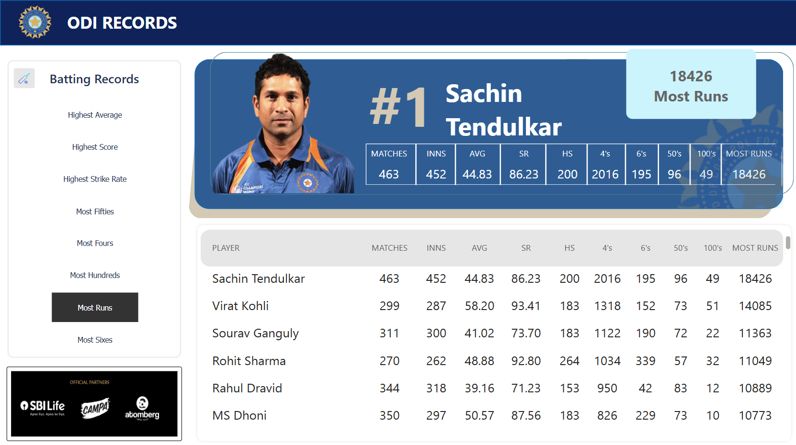

# ODI Batting Records - Power BI Dashboard
## 📌 Overview

This Power BI 📊 dashboard visualizes One Day International (ODI) 🏏 cricket records, focusing on batting statistics. It highlights the top run-scorer 🥇, Sachin Tendulkar, along with other leading batsmen and their respective statistics. The dashboard includes interactive filtering options for different batting records such as highest averages, highest scores, most hundreds, etc. 🎯📊🔥

---

## 🔥Features 
Player Rankings: 🏆 Displays the highest run-scorers in ODI cricket. 
Top Player Highlight: 🌟 Sachin Tendulkar is prominently featured with detailed career statistics. 
Interactive Filters: 🎛️ Users can switch between different batting records (e.g., Most Runs, Most Fours, Most Sixes). 
Data Table: 📋 Provides a tabular view of player statistics such as matches played, innings, batting average, strike rate, high score, boundaries, and centuries. 
Modern UI Design: 🎨 Uses a structured and visually appealing layout with branding elements. 

---

## 📊 Required Data
To replicate this dashboard, you need a dataset containing the following fields: 
Player Name 
Matches Played 
Innings Played 
Batting Average 
Strike Rate 
Highest Score 
Fours 
Sixes 
Fifties 
Hundreds 
Total Runs 

---

## 🖥️ Steps to Create the Dashboard 
1. Prepare the Dataset:  
Gather and clean data for ODI batting records. 
I used https://www.bcci.tv/international/men/stats/odi for the data. 
Ensure all columns are formatted correctly (e.g., numerical values for averages, runs, and strike rates). 

2. Load Data into Power BI:  
Import the dataset using Power BI Desktop. 
Verify that all fields are correctly categorized (e.g., numbers, text, etc.). 

3. Create Visualizations:  
Player Card: 🏆 Use a combination of a Card Visual and an Image to highlight the top player (Sachin Tendulkar in this case). 
Data Table: 📋 Use a Table Visual to display statistics for all players. 
Filters & Slicers: 🎛️ Add slicers to switch between different batting records. 
Custom Formatting: 🎨 Apply appropriate fonts, colors, and alignment for a professional look. 
  
4. Enhance Interactivity: 🖱 
Use slicers and filters to enable users to view different stats dynamically. 
Implement conditional formatting to highlight top performers. 

5. Publish and Share:  
Save the Power BI file (.pbix) and publish it to Power BI Service if needed. 
Share the dashboard link with relevant stakeholders. 

---  

## 🖥️ Tools & Technologies Used 

Power BI Desktop (for dashboard creation) 
DAX (Data Analysis Expressions) (for calculated measures) 
SQL / Excel (for data preprocessing, if necessary) 
Image Processing Tools (for adding custom visuals and logos) 

---

## 📸 Screenshot 

---

## 🌟 Future Enhancements 

Add more interactive visuals such as charts and graphs. 
Include filtering options for different time periods. 
Integrate real-time data updates if available. 

---

Author: [Sejal Rajput]  
Date: [16-03-2025] 
LinkedIn: https://www.linkedin.com/in/sejal-rajput/  
Version: 1.0 
